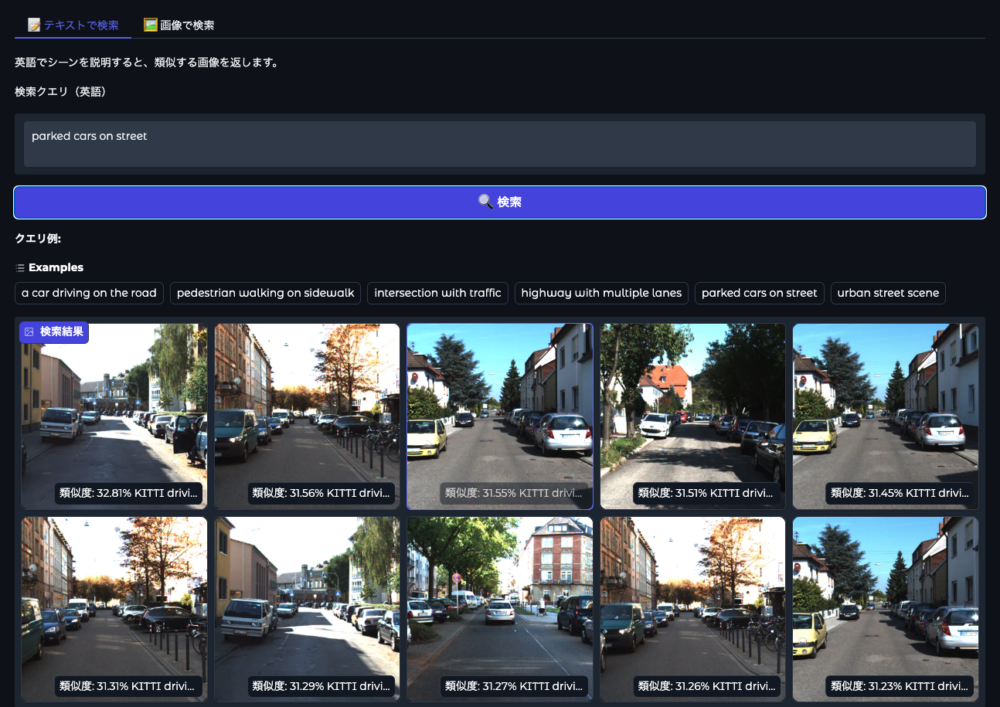
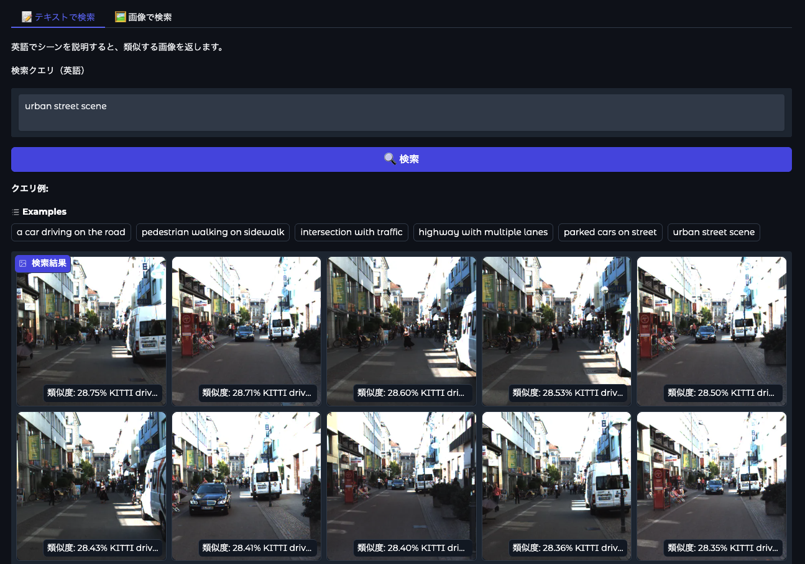
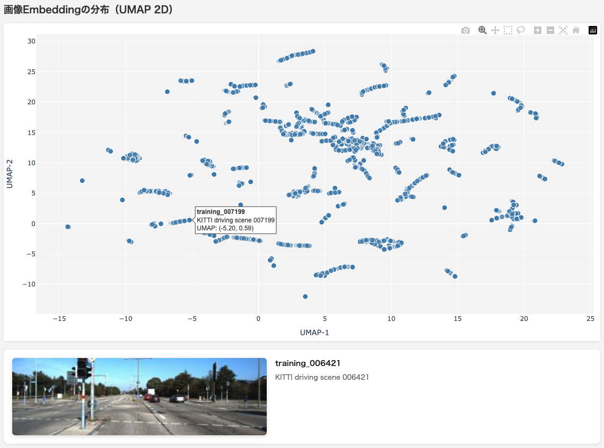

# セマンティック画像検索

KITTIドライビングデータセットをCLIPまたはSigLIPで埋め込み、ChromaDBで検索するシステムです。

画像の埋め込みをオフラインで事前計算しておくことで、クエリ時はテキストや画像の埋め込みだけで高速にセマンティック検索が行えます。GPUサーバー不要。

---

## スクリーンショット







---

## アーキテクチャ

```
[KITTI データセット (training/image_2/*.png)]
       │
       ▼  事前実行（scripts/index_kitti.py --model <model>）
  CLIP (512次元) または SigLIP (768次元) 埋め込み
       │
       ▼
  ChromaDB  ←  ローカルに永続化（db/）
             ※ モデルごとに別コレクション（images_clip / images_siglip）
       │
       ▼  クエリ時（app.py / search.py）
  テキスト / 画像クエリ → 埋め込み → コサイン類似度検索 → 結果
```

---

## 機能

- **テキスト → 画像検索** — 自然言語でシーンを説明し、視覚的に類似した画像を取得
- **画像 → 画像検索** — 画像をアップロードし、似たフレームを検索
- **モデル切り替え** — GradioのUIまたはCLIで CLIP / SigLIP を切り替え可能
- **UMAP可視化** — 埋め込みの分布を2次元散布図でインタラクティブに表示
- **Apple Silicon対応** — MPSバックエンドを自動検出
- **Gradio WebUI** — ギャラリー表示・ページネーション付きのブラウザ操作

---

## クイックスタート

### 1. 依存関係のインストール

```bash
pip install -r requirements.txt
```

### 2. KITTIデータセットの配置

`data_object_image_2.zip` を展開し、以下のディレクトリ構成にしてください:

```
data/
├── training/
│   └── image_2/
│       ├── 000000.png
│       ├── 000001.png
│       └── ...
└── testing/
    └── image_2/
        └── ...
```

### 3. インデックスの作成（一度だけ実行）

```bash
# CLIP（デフォルト）でインデックス作成
python scripts/index_kitti.py

# SigLIPでインデックス作成（別途実行が必要）
python scripts/index_kitti.py --model siglip
```

モデルごとに別のChromaDBコレクション（`images_clip` / `images_siglip`）に保存されます。

### 4. 検索

```bash
# Web UI → http://localhost:7860
python app.py

# CLI（CLIPで検索）
python search.py "a car driving on the road"

# CLI（SigLIPで検索）
python search.py --model siglip "pedestrian walking on sidewalk"
```

Web UIでは上部のラジオボタンでモデルを切り替えられます。対象モデルのインデックスが未作成の場合は警告が表示されます。

### 5. 埋め込み分布の可視化（オプション）

```bash
python scripts/analyze.py
# → embedding_map.html を生成してブラウザで表示
```

UMAPで全画像埋め込みを2次元に圧縮し、インタラクティブな散布図（`embedding_map.html`）を生成します。各点が1フレーム。ホバーでシーン名、クリックで画像を表示。

```bash
cd /path/to/image-search-project
python -m http.server 8080
# → http://localhost:8080/embedding_map.html
```

---

## プロジェクト構成

```
image-search-project/
├── src/                        # コアパッケージ
│   ├── config.py               # パス・設定（ここを編集）
│   ├── embedder.py             # BaseEmbedder 抽象クラス + get_embedder() ファクトリー
│   ├── clip_embedder.py        # CLIPEmbedder（512次元）
│   ├── siglip_embedder.py      # SiglipEmbedder（768次元）
│   └── store.py                # ChromaDB ラッパー
├── scripts/
│   ├── index_kitti.py          # インデックス作成（--model オプションあり）
│   └── analyze.py              # UMAP可視化
├── tests/
│   ├── test_embedder.py        # CLIP・SigLIPのユニットテスト
│   └── test_store.py
├── app.py                      # Gradio WebUI
├── search.py                   # CLI検索（--model オプションあり）
├── README.md                   # このファイル（日本語）
├── README_en.md                # 英語版README
├── data/                       # KITTIデータセット（gitignore対象）
├── db/                         # ChromaDB（gitignore対象）
└── requirements.txt
```

---

## モデル比較

| モデル | 埋め込み次元 | モデルサイズ | 特徴 |
|--------|------------|------------|------|
| CLIP (`openai/clip-vit-base-patch32`) | 512次元 | ~150MB | 軽量・高速。デフォルト |
| SigLIP (`google/siglip-base-patch16-224`) | 768次元 | ~400MB | シグモイド損失による学習でCLIPより精度向上。要`sentencepiece` |

---

## クエリ例

| クエリ | 期待される結果 |
|-------|--------------|
| `a car driving on the road` | 走行中の車両 |
| `pedestrian walking on sidewalk` | 歩行者のシーン |
| `intersection with traffic` | 複雑な交差点 |
| `highway with multiple lanes` | 広い道路 |
| `parked cars on street` | 路上駐車 |
| `urban street scene` | 市街地走行 |

---

## 動作要件

- Python 3.10+
- KITTIオブジェクト検出データセット（`data_object_image_2.zip`）
- Apple Silicon推奨（MPSアクセラレーション）。CPU-onlyでも動作可

---

## 参考リンク

- [CLIP on HuggingFace](https://huggingface.co/openai/clip-vit-base-patch32)
- [SigLIP on HuggingFace](https://huggingface.co/google/siglip-base-patch16-224)
- [KITTI Vision Benchmark Suite](https://www.cvlibs.net/datasets/kitti/)
- [ChromaDB documentation](https://docs.trychroma.com/)
- [UMAP documentation](https://umap-learn.readthedocs.io/)

英語版: [README_en.md](README_en.md)
